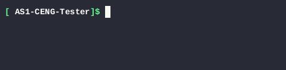
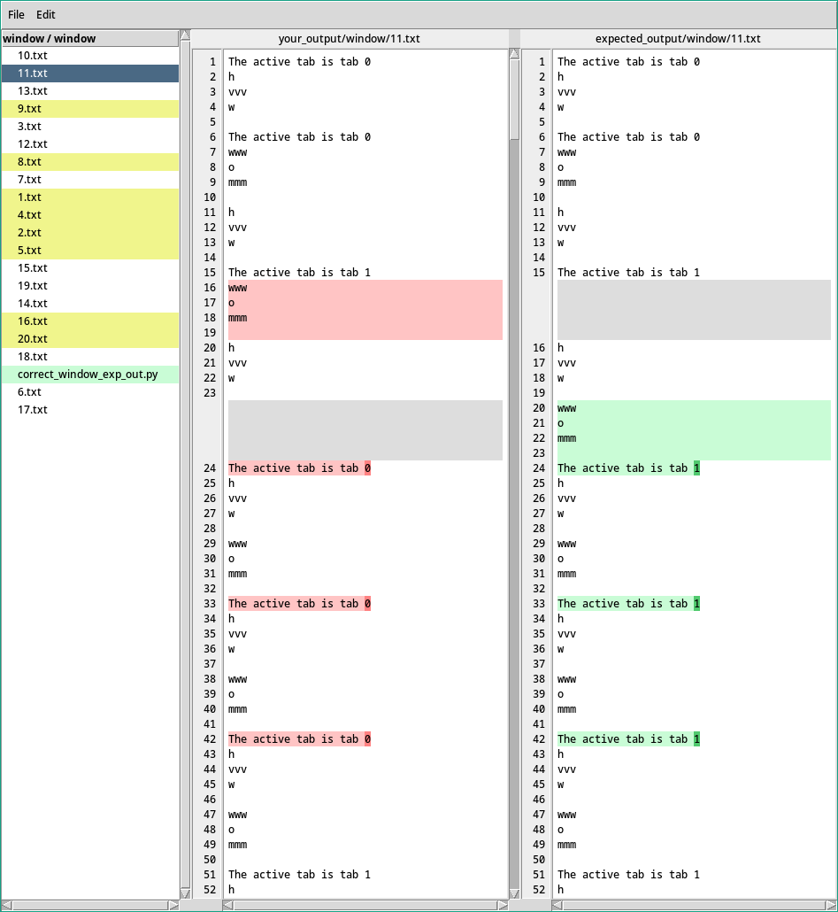

# AS1-CENG-Tester
 A script that will compile and run C++ test cases against your code to test against the given set of expected outputs

## Demo



## How to Use

### Prepare
 - Some test cases pair, each of them contains test code and a corresponding output. (Already included).
 - Code you are going to test.

Then put them as the following:

```
AS1-CENG-Tester
│   AS1_tester.py
│
└───your_code
│   │   (all your code files)
│   
└───cases (code for test cases goes here)
|    └───window
|    └───browser
|    
└───expected_output (expected outputs)
|    └───window
|    └───browser
```
You may also need to temporarily add the following public member function in your ```Browser.h``` file:
```cpp
    void addWindow(Window& w) {
        windows.append(w);
    }
```

### Usage
```
 python AS1_tester.py -h 
 usage: C++ Assignment Tester [-h] -p {window,browser} [-v] [-c CASE#] [-cc COMPILER_COMMAND] [-d]

A script that will compile and run C++ test cases and test against the given set of expected outputs

options:
  -h, --help            show this help message and exit
  -p {window,browser}, --program {window,browser}
                        The program to be tested
  -v, --verbose         Enables full logging
  -c CASE#, --cases CASE#
                        Specific case#(s) to be tested. Can be multiple space separated values.
  -cc COMPILER_COMMAND, --compiler-command COMPILER_COMMAND
  -d, --diff            Display diff between Given Output and Expected Output. Note: Requires Tkinter
  ```
  
  Test all cases for window and display diff
  ```
  python AS1_tester.py -p window -d 
  ```
## Credits
Thank you to [ogul1](https://github.com/ogul1) for providing the test cases!  
